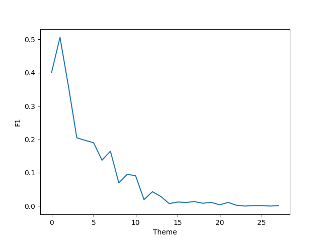

# Oracle Theme

对甲骨文进行主题分类。

模型：
- LSTM
- BERT-Chinese
- JiaguTextBERT（宋晨阳）

## Data


应该将 train、dev 和 test 数据放在同一个目录，比如：

- `./my/data/path/train.json`
- `./my/data/path/dev.json`
- `./my/data/path/test.json`

然后在 `train.py` 的第 20 行的 `data_dir` 设为数据所在路径：

```python
# ...
data_dir = Path('./my/data/path')
# ...
```


数据格式：

```json
[
  {
    "book_name": "H26018",
    "text": "鼎（貞）：翼（翌）…其冓（遘）…歲于■…",
    "theme": "來時 / 祭祀",
    "oracle_text": " 嗀瓠…磦昅…厺枂… "
  },
  {
    "book_name": "H27996",
    "text": " 庚…； 叀（惠）用沙于止（翦）方，不雉眾。； 戍※方戍。； 弗（翦）。； 戍…（翦）。",
    "theme": "問捷 / 方國",
    "oracle_text": " 域…譫笘 "
  },
  // ...
]
```

其中 `theme` 字段就是 label

> 目前无视 `oracle_text` 字段。

### Labels

The raw data is labeled manually, so the theme labeling schema is not very strict. We post-process the labels by merging similar labels. This results in 28 themes:

```python
['災難', '祭祀', '奴隸主貴族', '卜法', '氣象', '時間', '地名', '漁獵、畜牧', '人名', '方域', '戰爭', '吉凶、夢幻', '鬼神崇拜', '刑法', '死喪', '農業', '音樂', '飲食', '生育', '官吏', '居住', '貢納', '疾病', '文字', '軍隊', '天文', '奴隸和平民', '交通']
```


## Execution

### Training

执行：`python3 train.py`

### Testing

同上，将来会单独把 test 代码分离出来的。


## Result

Model               | Acc.  | Micro-F1 | Macro-F1
---                 | ---   | ---      | ---
LSTM                | 15.43 |  20.05   | 9.21
BiLSTM              | 
RBT3                | 81.00 | 75.76    | 42.37
BERT (Rand-init)    | 
BERT (Pretrained)   | 79.10 |


F1 of RBT3 on each theme sorted by example count (descending):



So, on less frequent themes, the F1 is very bad.
